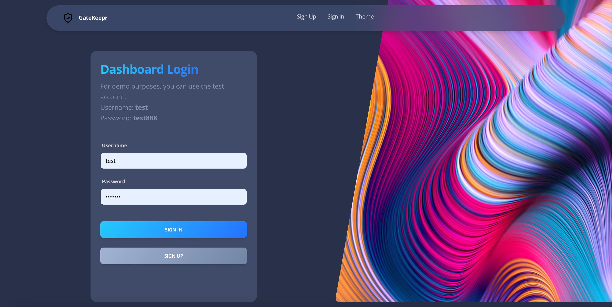
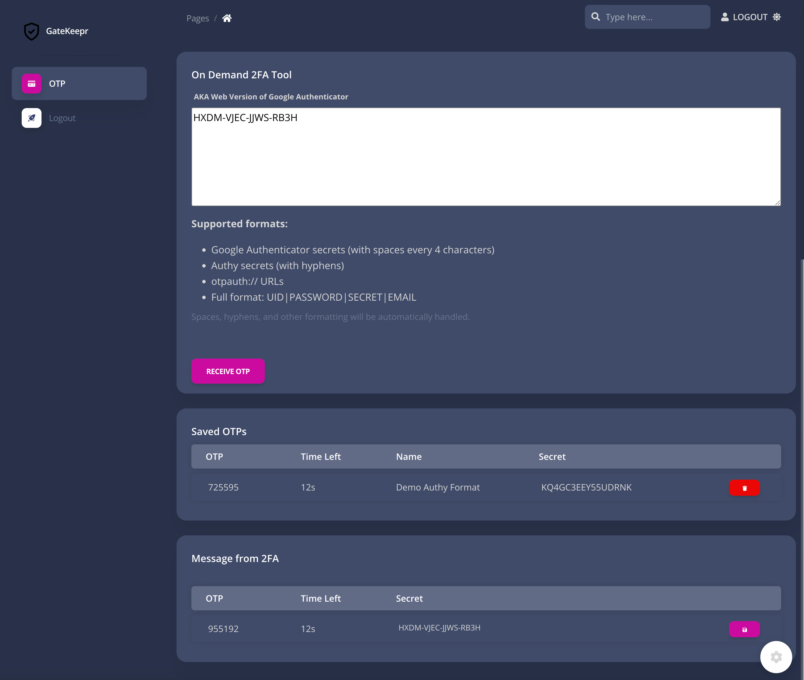

# 🔐 GateKeepr

> Advanced two-factor authentication management system. Streamlined solution for securely generating, storing, and managing OTP codes from multiple providers.[^1]

[^1]: GateKeepr empowers users with a reliable, secure way to manage authentication across all their accounts through an elegant, user-friendly interface.

## The Ultimate 2FA Management Tool

GateKeepr is a sophisticated two-factor authentication management system engineered to securely generate, store, and manage OTP codes. Built with a robust Flask backend and intuitive Bootstrap frontend, this application delivers consistent authentication across multiple services. The app supports various secret formats from common providers and automatically refreshes OTPs before expiration.

## :key: Login Preview







## ✨ Features

- **Multi-Provider Support**: Handles different secret formats from common providers
- **Secure Password Management**: Implements password hashing for user security
- **Automatic OTP Refresh**: Countdown timer with automatic refreshing before expiration
- **Persistent Storage**: Saves secrets securely for future sessions
- **One-Click Copy**: Copy OTPs to clipboard with a single click
- **Responsive UI**: Clean and intuitive interface with Bootstrap

## 🛠️ Technical Overview

GateKeepr works through a multi-stage process:
1. Securely authenticates users through Flask-Login
2. Processes and normalizes secrets from different providers
3. Generates accurate OTPs with proper timing
4. Securely stores user secrets in a configurable database
5. Provides intuitive management for adding and removing authentication entries
6. Dashboard Login page theme is by Appseed.


## 📋 Requirements

- Python with Flask
- SQLAlchemy
- Flask-Login
- Bootstrap
- JavaScript
- SQLite/MySQL (configurable)

## 🚀 Getting Started

1. Clone the repository

2. Run the application:
```bash
python run.py
```

3. Access the application:
```
http://127.0.0.1:5000
```

## 📊 Architecture

The app follows an elegant, maintainable architecture:

1. `run.py` - Main entry point that creates the Flask instance
2. `app/config.py` - Configuration settings (debug/production mode, secret, DB settings)
3. `app/__init__.py` - App initialization including database setup
4. `app/authentication/` - Handles login/signup and user management
5. `app/home/` - Contains main application functionality
6. `app/home/twofa.py` - Core OTP generation logic with `otp_gen` class

## ⚙️ Workflow

1. User logs in through the landing page (`/login`)
2. After authentication, user is redirected to the main page (`otp.html`)
3. User can paste new secrets in the input area
4. The app processes and normalizes different secret formats
5. OTPs are generated and displayed with countdown timers
6. Users can save secrets for future sessions or delete them as needed
7. OTPs can be copied to clipboard with a single click

## 🎮 Video Demo
Check out the application in action: [GateKeepr Demo](https://youtu.be/yf14eM25VIU)

## 📝 TODO

- QR Code Scanner to import secrets
- Time Synchronization
- API that returns OTP with the secret as parameter (i.e. gatekeepr.com/api/otp-gen?secret=xxxx)

---

**Disclaimer**: This tool is provided for educational purposes. Users are responsible for securing their authentication secrets and complying with all applicable terms of service.

*"One app for all your authentication needs" - GateKeepr*
